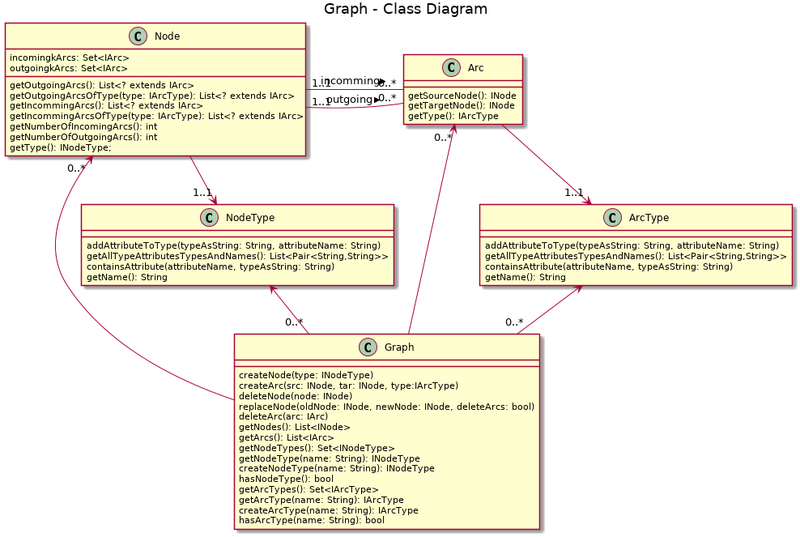
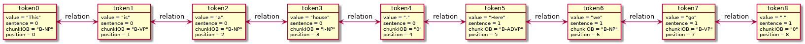
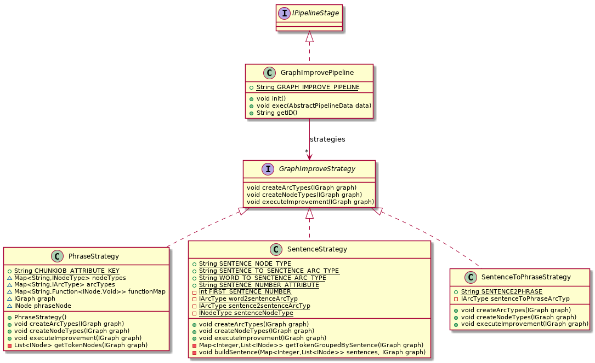
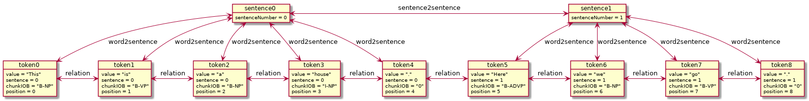
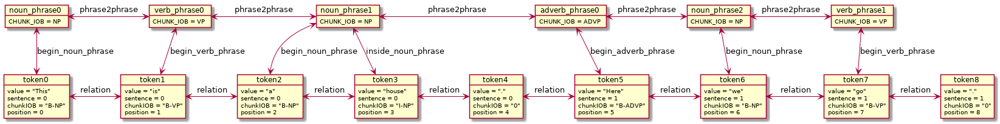
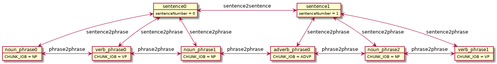
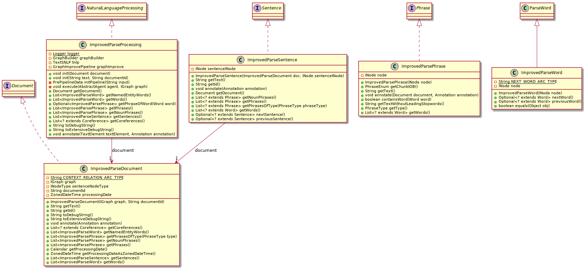

# GraphImprove

The GraphImprove project enhance performance and provide easy way to traverse the parsed sentences with P.A.R.S.E. This module was create as an intership in "Agile Werkzeuge" coordinated by [Anne Koziolek](mailto:anne.koziolek@kit.edu), mentored by [Jan Keim](mailto:jan.keim@kit.edu) and developed by [Dominik Klotz](mailto:uqtlt@student.kit.edu).


## P.A.R.S.E

The [P.A.R.S.E](https://parse.ipd.kit.edu/) project tokenizes an input string to tokens represented in a graph. The graph structure is displayed in the class diagram. As you can see below, a graph has multiple nodes and arcs (edges). A node and a arc has a type. Additionally the node and arc can have attributes. This graph structure is defined in such a generic way that you can build every data structure with it.

<!-- Insert INode, INodeType, IArcType, IArc, IGraph class diagramm -->


For example, when the string 'This is a house. Here we go.' is processed by P.A.R.S.E, then the graph below it the result. Each word is represented by an INode from INodeType token. The token has value, sentence, chunkIOB, position and additional attributes. Value is the word or the punctuation mark e.g. '?', the sentence is the sentence number, chunkIOB is the phrase type and the position is the token position inside the string. The relation between tokens is an arc from IArcType relation. In this way it is possible to navigate through the sentence.  

<!-- parse graph diagram -->


The parsed graph structure is a double linked list. To represent syntactical structures like sentences, phrases or words, the complete token node list has to be filtered for specific attributes. 

For example: 2. sentence of an input string:


```java
INodeType nodeType = graph.getNodeType("token");
List<INode> nodeList = graph.getNodeOfType(nodeType);

List<INode> sentence2 = nodeList.stream().filter(node -> node.getAttributeValue("sentence") == 2).collect(Collectors.toList());
```

As shown above, the generic definition is not sufficient to access all syntactical structures, which the [NLWrapper](#nlwrapper) tries to solve. 


## NLWrapper

The NLWrapper introduces the syntactical structures of document, sentence, phrase, word, co-reference and annotation to improve the readability of the code. It works directly on the graph structure provided by the P.A.R.S.E project. 

Example to retrieve the 2. sentence. 

```java
Document document = new ParseDocument(graph, "document-id");

Sentence sentence2 = document.getSentences().get(0);
```

The introduced syntactical structures of the natural language are directly understandable. The implementation of the 'getSentences' method looks similar to the P.A.R.S.E example. In this case, the graph is only decorated with these concepts. If you want to retrieve all phrases in a sentence, it becomes ugly and unmaintainable, because you have to process all words again to get the phrases inside the sentence. Additionally if multiple agents work on one document, it is inefficient, because the filtering on the token list is redone every method call. To avoid the refiltering for the concepts, the information can be stored directly in the graph. This concept solves the [GraphImprove Module](#graphimprove-module).

## GraphImprove Module

The GraphImprove enhanced the graph instead of decorating it with the syntactical structures available in the token list. This means it shifts the filtering from the runtime phase to the initial phase to avoid refiltering the concepts. 

### Improve Graph Pipeline

The improve graph pipeline is executed in the initial phase and implemented as an IPiplineStage from the PARSE project. 

As shown in the following class diagram, there is a SenteceStrategy, a PhraseStrategy and a SentenceToPhraseStrategy. 



The *SentenceStrategy* enhances the graph and introduces a sentence INodeType (sentence0 & sentence1) to represent a sentence. These INodes have an attribute sentenceNumber. Each sentence INode has an arc (word2sentence) to each word INode (token0 - token3 and token5 - token8). Additionally, for a better navigation from sentence to sentence, it adds an arc (sentence2sentence).



The *PhraseStrategy* is independent of the concept sentence. The following types of phrases are available in the P.A.R.S.E framework: 'noun\_phrase', 'prepositional\_phrase', 'verb\_phrase', 'adverb\_phrase', 'adjective\_phrase', 'subordinating\_conjunction', 'particle', 'interjection', 'conjunction\_phrase', 'unlike\_coodinated\_phrase' and 'list\_marker'. Each phrase its own INodeType (e.g. noun\_phrase, verb\_phrase, adverb\_phrase). The phrase INodes have arcs to the related words (begin\_noun\_phrase, inside\_noun\_phrase, begin\_verb\_phrase, begin\_adverb\_phrase). The difference is, that the first arc has the 'begin\_' and  all further the 'inside_' prefix. Each phrase is connected to the next phrase with a 'phrase2phrase' arc.

    
 

The *SentenceToPhraseStratagy* depends on the previous strategies and provides an easier connection between sentence and phrases. For this, the sentence2phrase arc is defined. 


 

### Access Decorator

The access decorator hides the internal graph structure as the NLWrapper has done it before. The following class diagram implements the same interfaces:



Instead of filtering the complete token list, it filters only the connected arcs to navigate to the next node.

This is an example to retrieve all words inside a sentence:
```java
	@Override
	public List<? extends Word> getWords() {
		return Filter.incomming(sentenceINode, SentenceStrategy.WORD_TO_SENCTENCE_ARC_TYPE).map(
				node -> new ImprovedParseWord(node)).collect(Collectors.toList());		
	}
```


And here an example to retrieve the next sentence:
```java
	public Optional<? extends Sentence> nextSentence(){
		return Filter.outgoing(this.sentenceINode, SentenceStrategy.SENTENCE_TO_SENCTENCE_ARC_TYPE).map(
				node -> new ImprovedParseSentence(document, node)
				).findFirst();
	}
```

If we look at the example to retrieve the 2. sentence, then it looks the same as in NLWrapper:
```java
Document document = new ImprovedParseDocument(graph, "document-id");

Sentence sentence2 = document.getSentences().get(0);
List<Phrases> phrases = sentence2.getPhrases();
```

The only difference is that we filter only the node arcs e.g. "sentence2phrase" instead of the complete sentence list. 


## Future work

In future, this project could be improved by using a model driven approach to generate the access layer. The access layer uses the same filter mechanism to retrieve the nextSentence or the word list of a sentence node (see [Access Decorator](#access-decorator)). The difference between retrieving all words and phrases in a sentence is only the IArcType. In this way the PARSE INodeType and IArcType could be used as meta model to define which types of nodes are existing e.g. sentence, word and which relationships (arcs) are existing between these nodes. Afterwards it is possible to generate the type of nodes as java classes and the arcs as methods with [Xtext](https://www.eclipse.org/Xtext/documentation/207_template.html). With this approach, it would be faster to change, add and test new node types. Additionally, the implementation of the navigation to the graph is consistently implemented. Currently the transformation from the P.A.R.S.E. model to the GraphImprove model still needs to be manually programmed.

